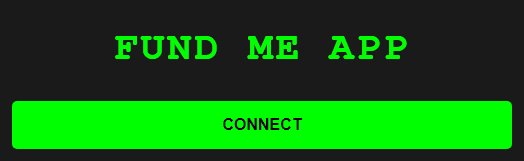

# html-foundme-front

This is a minimalistic example what you can find in the [metamask docs](https://docs.metamask.io/guide/create-dapp.html#basic-action-part-1).

# Requirements

- [git](https://git-scm.com/book/en/v2/Getting-Started-Installing-Git)
  - You'll know you've installed it right if you can run:
    - `git --version`
- [Metamask](https://metamask.io/)
  - This is a browser extension that lets you interact with the blockchain.

# Quickstart 

1. Clone the repo

```
git clone https://github.com/gaboegui/html-foundme-front.git
cd html-foundme-front
```

2. Run the `index.html` file

You can usually just double click the file to "run it in the browser". Or you can right click the file in your VSCode and run "open with live server" if you have the live server VSCode extension (ritwickdey.LiveServer).

And you should see a small button that says "connect".



Hit it, and you should see metamask pop up.

## Execute a transaction - Sepholia EVM

If you want to execute a transaction follow this:  

We have deploy a simple contract in Sepolia Network:

https://sepolia.etherscan.io/address/0x043222c13176bef909ef265f81f00c3de8d0b647

If you deploy a different contract based on the Project:

https://github.com/gaboegui/foundry-fundme

Then you should:

2. Update your `constants.js` with the new contract address.

In your `constants.js` file, update the variable `contractAddress` with the address of the deployed "FundMe" contract.

3. Connect your [metamask](https://metamask.io/) to sepolia network blockchain.

> **PLEASE USE A METAMASK ACCOUNT THAT ISNT ASSOCIATED WITH ANY REAL MONEY.**
> I usually use a few different browser profiles to separate my metamasks easily.

4. Be sure tahat you have Funds in your wallet. You can get some from this faucet:
https://cloud.google.com/application/web3/faucet/ethereum/sepolia

5. Refresh the front end, input an amount in the text box, and hit `fund` button after connecting

# Thank you!

If you appreciated this, feel free to follow me or donate!

ETH/Arbitrum/Optimism/Polygon/BSC/etc 
### Address: 0x2210C9bD79D0619C5d455523b260cc231f1C2F0D

[](https://x.com/GaBoEgui)

[](https://www.linkedin.com/in/gabrieleguiguren/)

